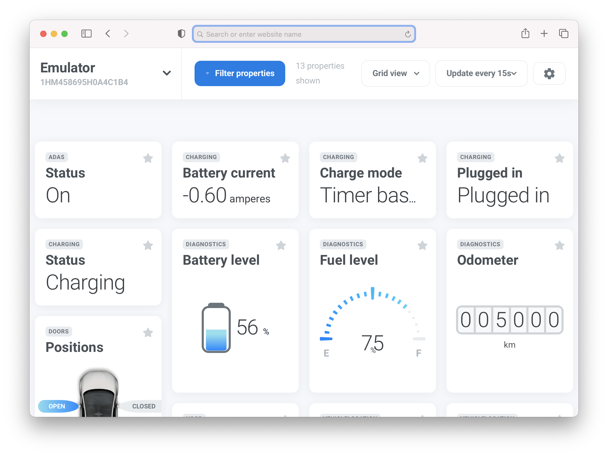
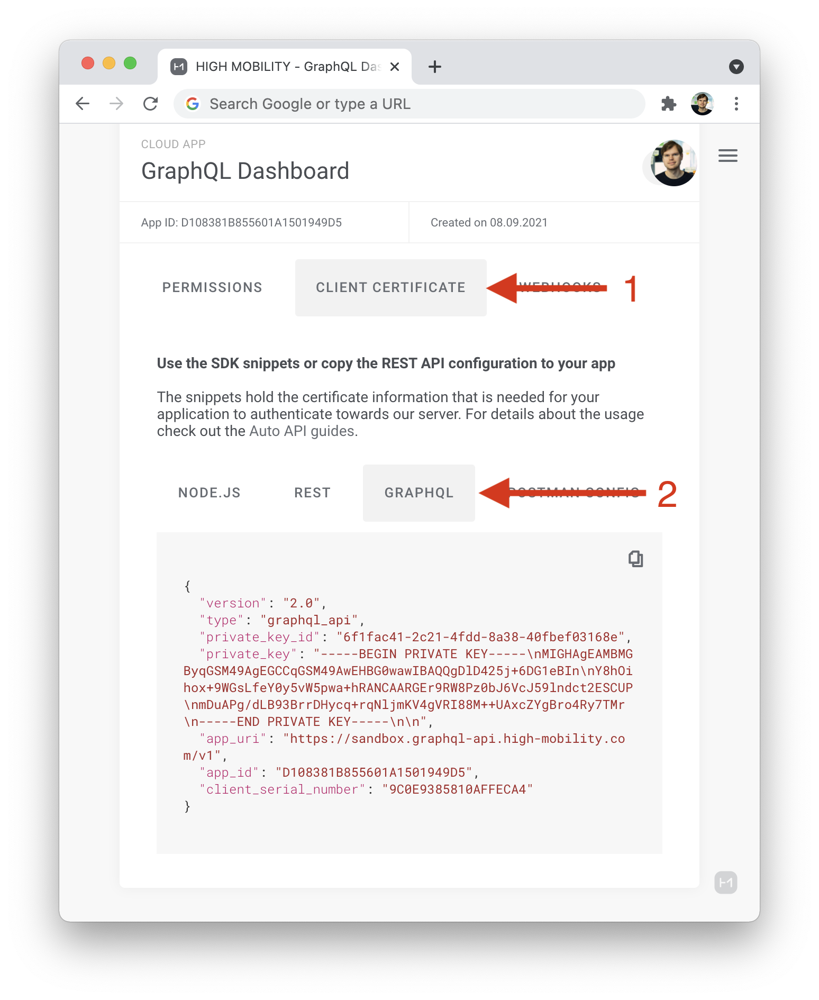

# High Mobility GraphQL sample app

This repo includes a Node.js app, which features a vehicle dashboard and demonstrates how to use the High Mobility GraphQL API.

# Table of contents

- [Getting started](#getting-started)
  - [Deploy to Heroku](#deploy-to-heroku)
  - [Where to find config information](#where-to-find-config-information)
- [Local setup](#local-setup)
  - [Requirements](#0-requirements)
  - [Start API](#1-start-api)
  - [Start client](#2-start-client)
  - [Open in browser](#3-go-to-http://localhost:3000)
  - [Creating and running migrations](#creating-and-running-migrations)
  - [Generating new config files](#generating-new-config-files)
- [Contributing](#contributing)
- [License](#license)

## Getting started

### Deploy to Heroku

### Where to find config information

Step 0: Make sure you have this sample app deployed. Once you load the root URL, you will be presented to configure it.

#### General Setup

1. Go to [high-mobility.com](https://high-mobility.com) and create an account or sign in
2. Create a Cloud App under the Develop tab. For exact details, have a look at the [Create App step](https://docs.high-mobility.com/guides/getting-started/graph-ql/#create-app) in our docs.
3. Choose the Client Certificate tab and then the GraphQL tab as shown in the screenshot below.

5. Second, you need to insert the OAuth2 configuration, which you will find under _My Settings/Team Settings > OAuth Client_. Note that for Cloud Apps created under the Production tab, the OAuth2 configuration is listed directly in the app details view.
6. In the same OAuth2 page, add the Redirect URI that is listed at the end of the configuration form of this app. This way you are redirected back to the app once the consent flow has finished.

#### Fleet apps

7. For fleet apps you will also need to insert fleet config. To download the JSON open your production app, then the service account keys tab, then click on the "+" button to download the config.
8. After initializing your app and adding a vehicle, click on the refresh button to refresh the vehicle's fleet clearance status. To automatically update this status, configure a webhook in the settings view.

## Local setup

#### 0. Requirements

- Node 16.14
- Postgres database

#### 1. Start API

- `npm i`
- `cp .env.example .env`
- Add database credentials to .env
- `npx knex migrate:latest`
- `npm start`

#### 2. Start client (in new window)

- `cd client`
- `npm i`
- `npm start`

#### 3. Go to http://localhost:3000

#### Creating and running migrations

`npx knex migrate:make my_first_migration`

`npx knex migrate:latest`

`npx knex migrate:rollback --all`

#### Generating new config files

`node generateConfig && cd client && npm i`

[Full documentation](https://knexjs.org/)

## Using behind a reverse proxy

When deployed behind a reverse proxy (like haproxy or nginx) requires the rewrite of the host header in the configuration of the reverse proxy, for connections towards the backend.

#### For haproxy

`http-request set-header Host "your.fixed.hostname"`

(see https://www.haproxy.com/documentation/hapee/latest/traffic-routing/rewrites/rewrite-requests/#set-a-header)

#### For nginx

`proxy_set_header Host "your.fixed.hostname";`

(see https://nginx.org/en/docs/http/ngx_http_proxy_module.html#proxy_set_header)

## Contributing

We would love to accept your patches and contributions to this project. Before getting to work, please first discuss the changes that you wish to make with us via [GitHub Issues](https://github.com/highmobility/hm-graphql-auto-api-explorer/issues) or [Slack](https://slack.high-mobility.com/).

See more in [CONTRIBUTING.md](https://github.com/highmobility/hm-graphql-auto-api-explorer/tree/main/CONTRIBUTING.md)

## License

This repository is using MIT license. See more in [LICENSE](https://github.com/highmobility/hm-graphql-auto-api-explorer/tree/main/LICENSE)
